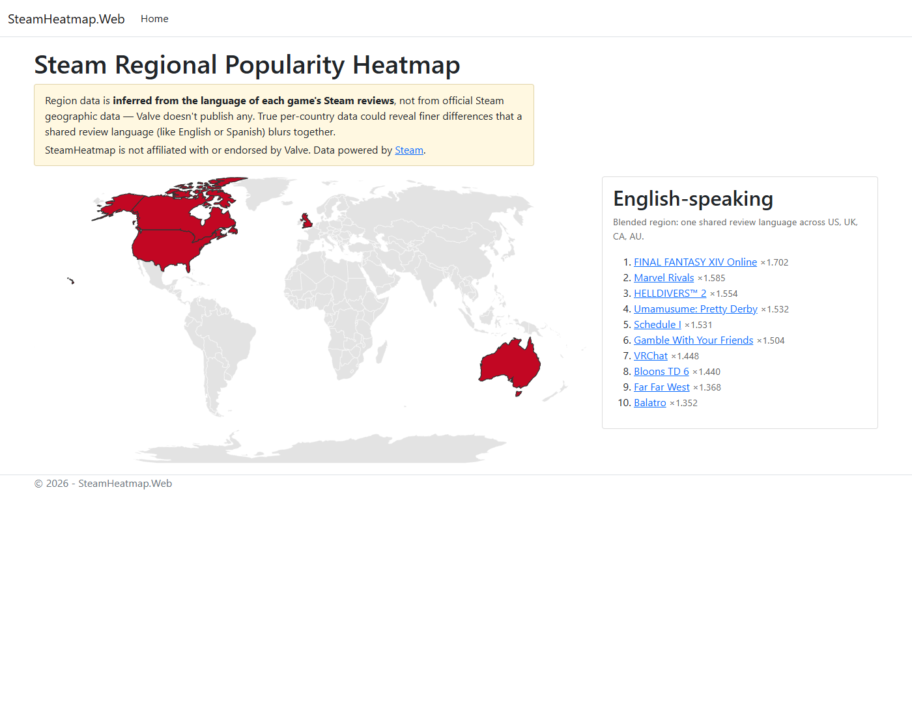

# Steam Regional Popularity Heatmap

An interactive world map showing which Steam games are **disproportionately
popular in each region** — not just globally popular. Hover any colored region
to see its top ten, ranked by how much more concentrated that game's audience
is there than the worldwide average.

**Live at [steamheatmap.azurewebsites.net](https://steamheatmap.azurewebsites.net)**
(free-tier hosting — the first load after idle takes ~30 seconds).



## The problem

Steam publishes no per-country or per-region player data — that exists only in
Valve's private partner backend. Anyone curious whether a game is a phenomenon
in Japan or Brazil specifically, rather than just big everywhere, has no tool
to find out.

## The approach

Every Steam review carries a language. A game's **review-language
distribution** is public, fetchable per game, and a usable proxy for where its
players are — with honest caveats, disclosed in the UI (some languages blend
many countries; English reviews say little about any single anglophone
country).

The interesting part is making the ranking trustworthy:

- **Concentration, not volume** — a game ranks high in a region when its share
  of reviews in that region's language is far above the region's *baseline*
  share across all tracked games. This surfaces regional favorites instead of
  repeating the same global blockbusters on every continent.
- **Wilson score lower bound** — raw shares from small samples are noisy, so
  the ranking uses the Wilson interval's lower bound: a game with 8 of 12
  reviews in Japanese scores far below one with 2,000 of 3,000, at the same
  raw percentage.

The result on real data: Street Fighter 6 tops Japan at ×11 concentration
while barely charting in Latin America — exactly the regional-taste signal raw
review counts can't show.

## Architecture

```
Steam Web API ──▶ Python daily pipeline ──▶ Postgres (Supabase) ──▶ ASP.NET Core MVC + D3 map
                  (GitHub Actions, cron)                            (reads latest run only)
```

- **`analysis/`** — Python. Once a day (GitHub Actions): fetch the current
  top-100 most-played games, pull per-language review counts for all 30 Steam
  review languages (~3,100 keyless API calls, 3% of the rate cap), compute
  Wilson-adjusted concentration scores per region, write to Postgres.
- **`web/`** — C# ASP.NET Core MVC. Reads the latest computed run from
  Postgres — never calls Steam or Python. Server-rendered Razor + plain CSS;
  D3.js scoped to the map widget, drawing self-hosted Natural Earth country
  boundaries.
- The two codebases share only the database and the top-level docs
  ([ADR-006](adr/006-csharp-python-shared-database-integration.md)).
- Hosting: Azure App Service (F1 free tier) for the web app, deployed by
  GitHub Actions on every push to `main` touching `web/`; Supabase free tier
  for Postgres ([ADR-007](adr/007-hosting-free-tier-then-vps.md)).

## Running locally

Both apps need `SUPABASE_DB_URL` in the environment (a Postgres connection
URI).

```bash
# Pipeline (from analysis/):  full run, or a cheap smoke run
python run_daily.py
TOP_N_GAMES=3 python run_daily.py

# Web app (from web/)
dotnet run

# Tests
python -m pytest                                   # from analysis/
dotnet test tests/SteamHeatmap.Web.Tests.csproj    # from web/
```

## How it's built

The engineering process is part of the product: strict TDD with one behavior
per test, one commit per red→green→refactor cycle, decisions interviewed and
recorded as ADRs, and end-to-end verification (live API runs, scripted
headless-browser checks) before any issue closes. The git history is meant to
be read — see **[docs/methodology.md](docs/methodology.md)** for the process
and its chronological evolution, and **[adr/](adr/)** for the twelve
architecture decision records behind the design.

## Disclosures

Region data is inferred from review-language distribution, not official Steam
geographic data. This project is not affiliated with or endorsed by Valve.
Data powered by [Steam](https://store.steampowered.com/).
